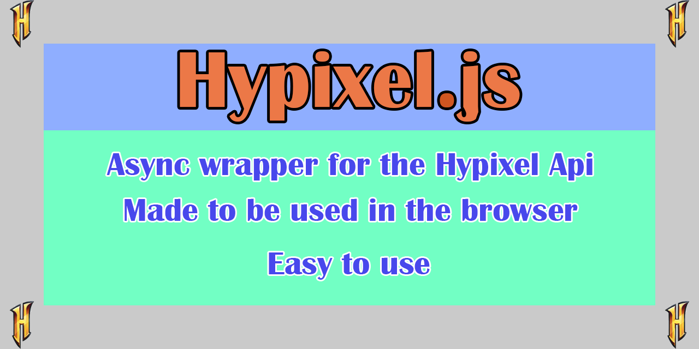

<p align="left">
  
</p>
A Hypixel api wrapper in javascript meant to be used in a website.

Huge thanks to the makers of Github Copilot, it is so nice to have!

# <a href="https://henry-santa.github.io/hypixel.js/">Docs</a>
### Please use the docs
# Installation
1. Download hypixel.js from the repo and place it in your folder that you would like to work in.
2. Create your own js file
3. add the following code to your js file
``` js
import * as HyJs from 'hypixel.js';
```
4. Now you can use the wrapper in your js file
5. You also need to add the following code to your html file
``` html
<script type="module" src="hypixel.js"></script>
<script type="module" src="yourJsFile.js"></script>
```
6. Now your code will run in the browser
7. Look at the examples folder for examples on how to use this wrapper
8. Explore the future documentation

# Version 1.0.0

## Todo
- Add documentation
- Add more examples
- Add nbt support

# Releasing in 3 days